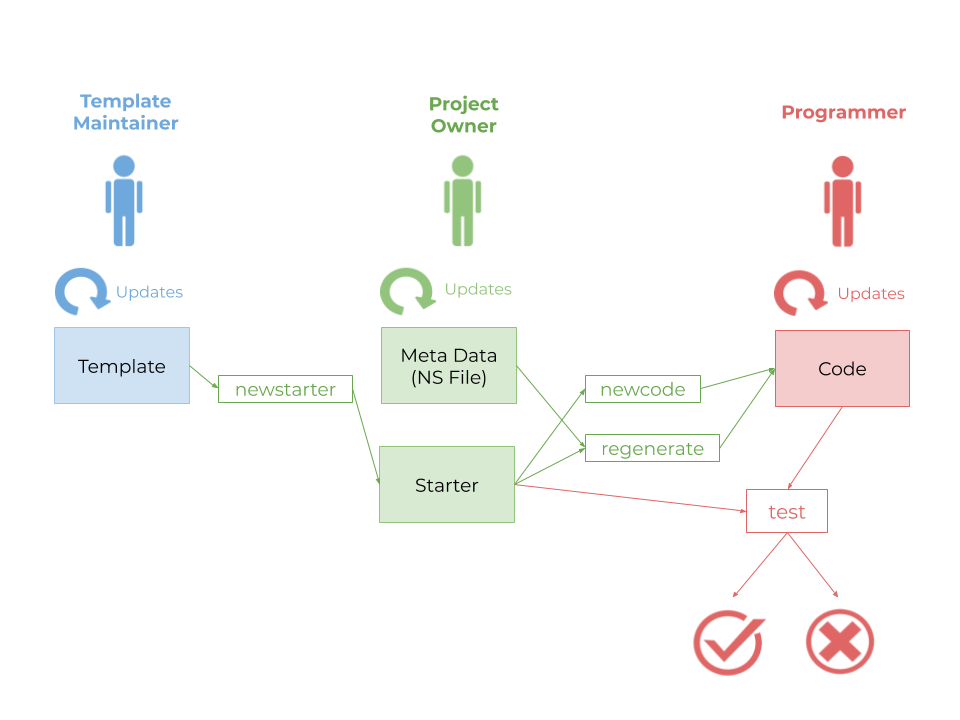
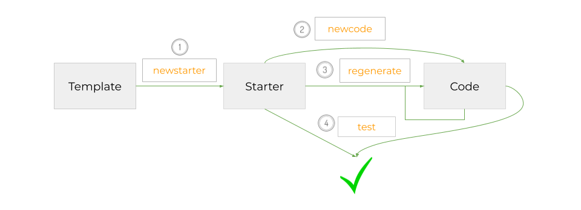

#ns-flip
A tool for creating and using *updatable* code templates.  Supports regeneration of code without losing custom changes. Framework agnostic.

<a href="https://spectrum.chat/ns-flip">
    
  </a>
  
  
[](https://oclif.io)
[](https://npmjs.org/package/ns-flip)
[](https://npmjs.org/package/ns-flip)
[](https://github.com/NoStackApp/ns-flip/blob/master/package.json)


<!-- toc -->
* [Why](#why)
* [What](#what)
* [How](#how)
* [Help](#help)
* [Usage](#usage)
* [Commands](#commands)
<!-- tocstop -->

# Why
After you generate code with a template or tool, you make changes to the code.  But then usually you can't regenerate it without losing your changes.  So you can't apply an updated template or change to another similar template. Keeping your "legacy code" current becomes an expensive pain.  

# What
ns-flip is a CLI to support code templates that can be exchanged as easily as WordPress themes.


A template can generate three types of files:

1. standard (appear in every generated code base, e.g. `App.jsx`)
2. custom static (static, but must be custom specified for each code base, e.g. steps in an input stepper)
3. custom dynamic (based on queries e.g. components showing query results).

You can create templates with locations designated for custom code.  You can also name regions that can be replaced or removed in the generated code.  Ns-flip stores the custom changes before regenerating and restores them.

See some [standard use cases](https://github.com/NoStackApp/ns-flip/wiki/Uses).

# How
A _template_ is a directory with requirements explained in the [documentation](http://ns-flip.nostack.net/).  You can use it privately or distribute it.  To create one, you will need a basic working knowledge of [Handlebars](https://handlebarsjs.com/guide/) and not much more.



To generate code from a template:
1. Create a _starter_ directory by calling [`ns newstarter -t <template> -s <starter>`](#ns-newstarter).  
2. Create a code base using the starter: [`ns newcode -c <code path> -s <starter>`](#ns-newcode).
3. The code base will have a `meta` directory with a sample ns file `meta/ns.yml`.  You can modify the ns file to change data types for dynamic files and any static information needed.  After any modifications, regenerate the code using [`ns regenerate -c <code>`](#ns regenerate)
4. Anyone can add custom code.  But periodically run  [`ns test -c <code>`](#ns-test) to be certain you did it right.  (Otherwise, some of your changes will not be preserved when `ns regenerate` is run in the future.)

Whenever you want to run an updated version of the template, create a new starter (as in step 1) and then run `ns regenerate -c <code>` again.

Here's a [sample template](https://github.com/YizYah/basicNsFrontTemplate).

# Help

* Read our [documentation](http://ns-flip.nostack.net)
* Post questions on our [Community](https://spectrum.chat/ns-flip)
*  [open issues](https://github.com/NoStackApp/ns-flip/issues/new)

[](http://www.youtube.com/watch?v=_Wg1J9KKvns)


# Usage
<!-- usage -->
```sh-session
$ npm install -g ns-flip
$ ns COMMAND
running command...
$ ns (-v|--version|version)
ns-flip/1.6.8 linux-x64 node-v14.9.0
$ ns --help [COMMAND]
USAGE
  $ ns COMMAND
...
```
<!-- usagestop -->

# Commands
<!-- commands -->
* [`ns help [COMMAND]`](#ns-help-command)
* [`ns newcode`](#ns-newcode)
* [`ns newstarter`](#ns-newstarter)
* [`ns newtemplate`](#ns-newtemplate)
* [`ns regenerate`](#ns-regenerate)
* [`ns test`](#ns-test)

## `ns help [COMMAND]`

display help for ns

```
USAGE
  $ ns help [COMMAND]

ARGUMENTS
  COMMAND  command to show help for

OPTIONS
  --all  see all commands in CLI
```

_See code: [@oclif/plugin-help](https://github.com/oclif/plugin-help/blob/v3.2.0/src/commands/help.ts)_

## `ns newcode`

new code base, based on a starter. You can use `generate` to update based on the `ns.yml` file.

```
USAGE
  $ ns newcode

OPTIONS
  -c, --codeDir=codeDir        code base directory
  -h, --help                   show CLI help
  -s, --starterDir=starterDir  starter directory.

EXAMPLE
  $ ns newcode -c ~/projects/myapp -s ~/ns/starters/current
```

_See code: [lib/commands/newcode.js](https://github.com/NoStackApp/ns-flip/blob/v1.6.8/lib/commands/newcode.js)_

## `ns newstarter`

create new starter from a template.  You can then generate a new code base from it using `newCode`.

```
USAGE
  $ ns newstarter

OPTIONS
  -c, --sampleDir=sampleDir      optional sample generated code directory
  -f, --force                    when force is used, the starter is overwritten without warning.
  -h, --help                     show CLI help
  -s, --starterDir=starterDir    starter directory
  -t, --templateDir=templateDir  template directory

EXAMPLES
  $ ns newstarter -t ~/ns/templates/basicTemplate -s ~/ns/starters/mystarter
  $ ns newstarter -t $TEMPLATE -s $STARTER -c ~/ns/samples/out
  $ ns newstarter -t $TEMPLATE -s $STARTER -c $CODE -f
```

_See code: [lib/commands/newstarter.js](https://github.com/NoStackApp/ns-flip/blob/v1.6.8/lib/commands/newstarter.js)_

## `ns newtemplate`

create new template.

```
USAGE
  $ ns newtemplate

OPTIONS
  -h, --help  show CLI help

EXAMPLE
  $ ns newtemplate
```

_See code: [lib/commands/newtemplate.js](https://github.com/NoStackApp/ns-flip/blob/v1.6.8/lib/commands/newtemplate.js)_

## `ns regenerate`

regenerates code based on a meta file `ns.yml`, custom changes, and a starter. The code directory must have been created for the first time using `newcode`.

```
USAGE
  $ ns regenerate

OPTIONS
  -c, --codeDir=codeDir  code directory
  -h, --help             show CLI help

EXAMPLE
  $ nd regenerate -c ~/projects/myapp
```

_See code: [lib/commands/regenerate.js](https://github.com/NoStackApp/ns-flip/blob/v1.6.8/lib/commands/regenerate.js)_

## `ns test`

Confirms that your custom changes have been entered safely, allowing you to generate with an updated or replaced template, or with a changed 'ns.yml' file. For documentation about the rules for custom code placement, please see http://ns-flip.nostack.net//Safe-Custom-Code.

```
USAGE
  $ ns test

OPTIONS
  -c, --codeDir=codeDir  code base directory
  -h, --help             show CLI help

DESCRIPTION
  Essentially, the test generates a new version of the code and then simply compares it against your current version.  
  If there are differences, then there is a problem with your code.

EXAMPLE
  $ ns test -c ~/projects/myapp
```

_See code: [lib/commands/test.js](https://github.com/NoStackApp/ns-flip/blob/v1.6.8/lib/commands/test.js)_
<!-- commandsstop -->
