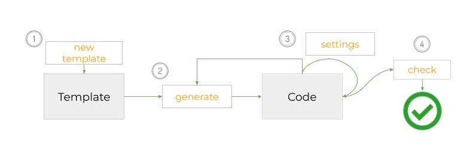

# ns-flip
A tool for creating and using *updatable* code templates.  Supports regeneration of code without losing custom changes. Framework agnostic.

<a href="https://spectrum.chat/ns-flip">
    
  </a>
  
  
[](https://oclif.io)
[](https://npmjs.org/package/ns-flip)
[](https://npmjs.org/package/ns-flip)
[](https://github.com/NoStackApp/ns-flip/blob/master/package.json)


<!-- toc -->
* [Why](#why)
* [What](#what)
* [How](#how)
* [Help](#help)
* [Usage](#usage)
* [Commands](#commands)
<!-- tocstop -->

# Why
After you generate code with a template or tool, you make changes to the code.  But then usually you can't regenerate it without losing your changes.  So you can't apply an updated template or change to another similar template. Keeping your "legacy code" current becomes an expensive pain.  

# What
ns-flip is a CLI to support code templates that can be exchanged as easily as WordPress themes.

A template can generate three types of files:

1. standard (appear in every generated code base, e.g. `App.jsx`)
2. custom static (static, but must be custom specified for each code base, e.g. steps in an input stepper)
3. custom dynamic (based on queries e.g. components showing query results).

You can create templates with locations designated for custom code.  You can also name regions that can be replaced or removed in the generated code.  Ns-flip stores the custom changes before regenerating and restores them.

See some [standard use cases][2].

# How
A _template_ is a directory with requirements explained in the [documentation][1].  You can use it privately or distribute it.  To create one, you will need a basic working knowledge of [Handlebars](https://handlebarsjs.com/guide/) and not much more.



1. Build a template from sample code by calling [`ns newtemplate`](#ns-newtemplate).  
2. Generate or regenerate code from the template : [`ns generate $CODE [-t $TEMPLATE`](#ns-generate-codedir).  All safe changes to $CODE are preserved.  There's also a meta 'ns' file that stores settings for the code base such as custom instances for data types used in the template.
3. Add custom code.  But periodically run  [`ns check $CODE`](#ns-check-codedir) to be sure or doing it safely.  (Otherwise, some of your changes will not be preserved when `ns generate` is run in the future.)

# Help

* Read our [documentation][1]
* Post questions on our [Community](https://spectrum.chat/ns-flip)
*  [open issues](https://github.com/NoStackApp/ns-flip/issues/new)

[](https://youtu.be/whb6B2FA_Yo)

# Usage
<!-- usage -->
```sh-session
$ npm install -g ns-flip
$ ns COMMAND
running command...
$ ns (-v|--version|version)
ns-flip/2.2.4 linux-x64 node-v14.9.0
$ ns --help [COMMAND]
USAGE
  $ ns COMMAND
...
```
<!-- usagestop -->

# Commands
<!-- commands -->
* [`ns check CODEDIR`](#ns-check-codedir)
* [`ns contact [MESSAGE]`](#ns-contact-message)
* [`ns filediffs TEMPLATEDIR`](#ns-filediffs-templatedir)
* [`ns generate CODEDIR`](#ns-generate-codedir)
* [`ns help [COMMAND]`](#ns-help-command)
* [`ns newtemplate`](#ns-newtemplate)
* [`ns settings CODEDIR`](#ns-settings-codedir)

## `ns check CODEDIR`

Confirms that your custom changes have been entered safely, allowing you to generate with an updated or replaced template, or with a changed 'ns.yml' file. Essentially, generates a new version of the code and then simply compares it against your current version.  If there are differences, then there is a problem with your code. For documentation about safe custom code changes, please see https://ns-flip.nostack.net//Safe-Custom-Code.

```
USAGE
  $ ns check CODEDIR

ARGUMENTS
  CODEDIR  directory containing the code to check

OPTIONS
  -h, --help  show CLI help

EXAMPLE
  $ ns check ~/projects/myapp
```

_See code: [lib/commands/check.js](https://github.com/NoStackApp/ns-flip/blob/v2.2.4/lib/commands/check.js)_

## `ns contact [MESSAGE]`

send feedback or request to ns-flip.  Optionally provide email and other fields.

```
USAGE
  $ ns contact [MESSAGE]

ARGUMENTS
  MESSAGE  the message to send

OPTIONS
  -e, --email=email  email of sender
  -h, --help         show CLI help

EXAMPLES
  $ ns contact "how do I set up comment delimiters with escape chars?" -e pauljones123@gmail.com
  $ ns contact "generate is breaking when I add handlers."
```

_See code: [lib/commands/contact.js](https://github.com/NoStackApp/ns-flip/blob/v2.2.4/lib/commands/contact.js)_

## `ns filediffs TEMPLATEDIR`

compare the files in your sample target code and in the code being generated. In some cases makes suggestions.

```
USAGE
  $ ns filediffs TEMPLATEDIR

ARGUMENTS
  TEMPLATEDIR  directory containing the template

OPTIONS
  -c, --codeDir=codeDir      code directory.  Will override the default
  -h, --help                 show CLI help
  -s, --sampleDir=sampleDir  sample directory.  Will override the default

EXAMPLE
  $ ns filediffs $TEMPLATE -c $CODE -s $SAMPLE
```

_See code: [lib/commands/filediffs.js](https://github.com/NoStackApp/ns-flip/blob/v2.2.4/lib/commands/filediffs.js)_

## `ns generate CODEDIR`

generates code based on a template and an 'ns file'.  To set the template, you need the template flag.

```
USAGE
  $ ns generate CODEDIR

ARGUMENTS
  CODEDIR  directory containing the code to check

OPTIONS
  -h, --help                     show CLI help

  -n, --noSetup                  Do not update the startup routine (this is only relevant when the templateDir flag is
                                 also used). Saves a lot of time for a template developer.

  -t, --templateDir=templateDir  Template directory. Will generate from the template, and will override any prior
                                 template or template version used.

EXAMPLES
  $ ns generate ~/ns/samples/out -t ~/ns/templates/basicTemplate
  $ ns generate $CODE -t $TEMPLATE --noSetup
  $ ns generate $CODE
```

_See code: [lib/commands/generate.js](https://github.com/NoStackApp/ns-flip/blob/v2.2.4/lib/commands/generate.js)_

## `ns help [COMMAND]`

display help for ns

```
USAGE
  $ ns help [COMMAND]

ARGUMENTS
  COMMAND  command to show help for

OPTIONS
  --all  see all commands in CLI
```

_See code: [@oclif/plugin-help](https://github.com/oclif/plugin-help/blob/v3.2.0/src/commands/help.ts)_

## `ns newtemplate`

create new template.

```
USAGE
  $ ns newtemplate

OPTIONS
  -h, --help  show CLI help

EXAMPLE
  $ ns newtemplate
```

_See code: [lib/commands/newtemplate.js](https://github.com/NoStackApp/ns-flip/blob/v2.2.4/lib/commands/newtemplate.js)_

## `ns settings CODEDIR`

create new template.

```
USAGE
  $ ns settings CODEDIR

ARGUMENTS
  CODEDIR  directory containing the code

OPTIONS
  -h, --help  show CLI help

EXAMPLE
  $ ns settings $CODE
```

_See code: [lib/commands/settings.js](https://github.com/NoStackApp/ns-flip/blob/v2.2.4/lib/commands/settings.js)_
<!-- commandsstop -->


   [1]: https://ns-flip.nostack.net/
   [2]: https://ns-flip.nostack.net/uses
